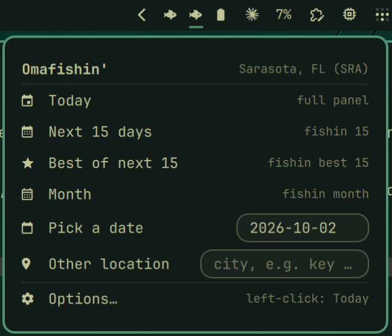

# Omafishin'

An [Omarchy](https://omarchy.org) bar widget for [fishin'](https://github.com/sjwasko/fishin), a terminal app that predicts the best fishing times and days from solunar, tide, and weather data.

Click the fish in your bar to see today's forecast. Right-click it to pick another view, a date, or a different location, or to change what a left-click shows.



## Install

```
omarchy plugin add https://github.com/sjwasko/omafishin --enable
```

The fish appears on the right side of the bar.

Omafishin' runs the `fishin` command. If fishin isn't installed, the first click opens a terminal that offers to install it for you:

```
pipx install git+https://github.com/sjwasko/fishin
```

You need [pipx](https://pipx.pypa.io) for that (`sudo pacman -S python-pipx`). fishin also runs on macOS and other Linux systems; see its repo for details.

### Set your location

fishin keeps your default location in `~/.config/fishin/config.toml`. Set it once from a terminal:

```
fishin --city "sarasota fl" --save
```

Omafishin' uses that location unless you choose a custom city in Options.

## Use

| Action | What happens |
|---|---|
| Left-click | Opens your default view (Today unless you change it) |
| Right-click | Opens the panel |
| Hover | Shows the location and default view |

### The panel

| Row | Runs |
|---|---|
| Today | `fishin`: the full panel for today |
| Next N days | `fishin N`: a compact list |
| Best of next N | `fishin best N`: days ranked by score |
| Month | `fishin month`: a calendar with star-rated days |
| Pick a date | `fishin --date YYYY-MM-DD`: type a date and press Enter |
| Other location | `fishin --city "..."`: a one-off lookup that doesn't change your saved location |
| Options… | Opens the settings page |

Keyboard: ↑/↓ to move, Enter to choose, ←/→ to change an option, Esc to go back or close.

### Options

Changes save as soon as you make them.

| Option | Choices |
|---|---|
| Default view (left-click) | Today, Next N days, Best of next N, Month |
| Days (list / best) | 1–15 |
| Location | fishin saved, or a custom city |
| Custom city | A place name, such as `key west fl` |
| Display name | Optional title for the forecast panel |
| Include tides | On / off (`--no-tides`) |
| Include weather | On / off (`--no-weather`) |
| Window mode | Floating or tiled |
| Keep open until keypress | On / off |

Days stop at 15 because the weather forecast fishin uses only covers about 16 days, and asking for more drops the weather from the whole view.

## Uninstall

```
omarchy plugin remove swasko.omafishin
```

This removes only the bar widget. To remove fishin too, run `pipx uninstall fishin`. Your location stays in `~/.config/fishin/` until you delete it.

## Repository

Developed on a private Forgejo instance and mirrored here automatically. The fishin' app itself is developed at [sjwasko/fishin](https://github.com/sjwasko/fishin).

## License

MIT. See [LICENSE](LICENSE).
